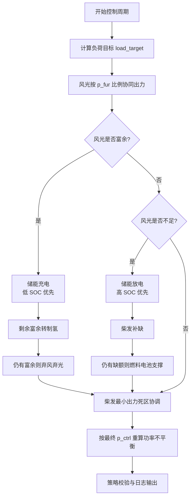
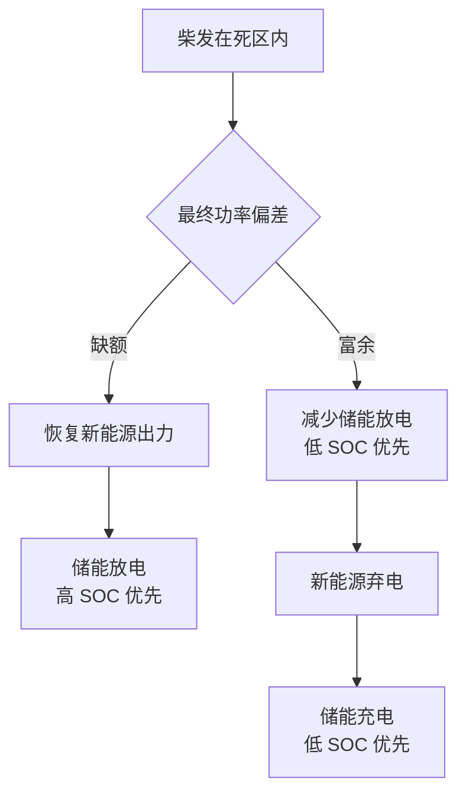

# 风光氢储柴协同控制逻辑

本文档整理 `agc/agc_ctrl.py` 中当前实现的 AGC 控制策略。控制对象来自 AGC E 模型文件，典型设备包括风机、光伏、制氢/燃料电池遥调点、储能、柴油发电机和负荷。

## 1. 控制目标

AGC 控制以一个控制周期内的负荷目标为输入，生成各类设备的有功控制指令 `p_ctrl`，目标是：

- 风光优先消纳，风电和光伏按最大可发出力比例协同分配。
- 储能参与功率平衡，同时执行 SOC 均衡策略。
- 柴油发电机参与缺额补偿，但受最小出力死区协调。
- 富余新能源优先储能充电，其次制氢，最后弃风弃光。
- 缺额优先储能放电，其次柴发，最后燃料电池支撑。
- 所有有功控制指令受设备级控制步长 `p_step` 约束。

## 2. 关键设备属性

| 设备类型 | 属性 | 含义 |
| --- | --- | --- |
| 风机、光伏、柴发、储能 | `p_step` | 单周期有功控制步长。设备级属性优先；若未配置，兼容旧全局参数。 |
| 风机、光伏、柴发 | `p_dead` | 有功控制死区。当前主要用于柴发最小出力死区。 |
| 储能 | `soc_dead` | SOC 控制死区。用于限制接近 SOC 上下限时的充放电。 |
| 储能 | `soc_cur` | 当前 SOC。 |
| 储能 | `soc_min` / `soc_max` | SOC 下限和上限。 |
| 储能 | `charge_p_max` | 最大充电功率。 |
| 储能 | `dis_charge_p_max` | 最大放电功率。 |
| 风机、光伏 | `p_fur` | 当前周期最大可发或预测可发功率。 |
| 柴发 | `p_min` / `p_max` | 柴发最小和最大有功出力。 |

储能 SOC 约束：

- 当 `soc_cur >= soc_max - soc_dead` 时，禁止充电。
- 当 `soc_cur <= soc_min + soc_dead` 时，禁止放电。

有功步长约束：

- 目标指令先按物理上下限截断。
- 再按 `p_step` 限制为 `[当前控制值 - p_step, 当前控制值 + p_step]`。
- 最终再次按物理上下限截断后写入 `p_ctrl`。

## 3. 主控制流程

控制程序支持两种执行方式：

- 周期执行：默认进入 AGC 循环，按 `CTRL_TRIGGER` / `GATHER_TRIGGER` 周期运行。
- 单步执行：命令行增加 `--step`，立即执行一次“采集 -> 预测 -> 控制 -> 校验 -> 输出”后退出，不等待周期对齐。
- 单步控制：命令行增加 `--ctrl-step`，立即执行一次“控制 -> 校验 -> 输出”后退出，不做采集和新能源预测，适合使用模型中已有运行态数据直接触发一次控制。



## 4. 风光协同控制

风机和光伏均作为新能源资源参与优先出力。控制逻辑不再按设备顺序逐台填满负荷，而是按最大可发出力 `p_fur` 比例分配。

设：

- 负荷目标为 `P_load`
- 全部运行风光设备的最大可发之和为 `P_ren_avail = sum(p_fur)`
- 单台新能源设备最大可发为 `p_fur_i`

则：

- 若 `P_load >= P_ren_avail`，所有风光设备按最大可发出力运行。
- 若 `P_load < P_ren_avail`，单台目标出力为：

```text
p_ctrl_target_i = p_fur_i * P_load / P_ren_avail
```

随后每台设备目标值还会经过 `p_step` 步长约束和自身上下限约束。

## 5. 储能均衡控制

储能参与所有充放电调节时都执行 SOC 均衡原则：

| 场景 | 排序原则 | 目的 |
| --- | --- | --- |
| 储能充电 | 低 SOC 优先 | 优先补低电量设备，拉升低 SOC。 |
| 储能放电 | 高 SOC 优先 | 优先释放高电量设备，降低高 SOC。 |
| 减少储能放电 | 低 SOC 优先减少 | 避免低 SOC 设备继续放电。 |
| 减少储能充电 | 高 SOC 优先减少 | 避免高 SOC 设备继续充电。 |
| 强制储能充电 | 低 SOC 优先 | 柴发低于下限且新能源已降到下限后吸收富余。 |
| 强制储能放电 | 高 SOC 优先 | 柴发高于下限且新能源已恢复后补足缺额。 |

充放电前先检查 SOC 死区：

- 充电路径调用 `soc_cur < soc_max - soc_dead` 判断。
- 放电路径调用 `soc_cur > soc_min + soc_dead` 判断。

## 6. 风光富余处理

风光协同出力后，如果新能源可发仍大于已消纳出力，则进入富余处理：


处理顺序：

1. 储能优先充电，低 SOC 设备优先。
2. 储能无法完全吸收时，向包含“制氢”或“电解”关键字的遥调点下发吸收指令。
3. 仍有富余时，降低风光 `p_ctrl`，执行弃风弃光，但不低于设备 `p_min`。

## 7. 风光不足处理

风光协同出力后，如果仍有负荷缺额，则进入缺额处理：


处理顺序：

1. 储能优先放电，高 SOC 设备优先。
2. 储能无法完全补足时，运行柴发按 `p_min/p_max` 约束补缺。
3. 仍有缺额时，向包含“燃料电池”或“燃电”关键字的遥调点下发支撑指令。

## 8. 柴发最小出力死区协调

初始风光、储能、柴发调节后，会执行柴发最小出力死区协调。该逻辑使用每台运行柴发的 `p_min` 和 `p_dead`，汇总得到总死区边界：

```text
diesel_lower = sum(p_min_i - p_dead_i)
diesel_upper = sum(p_min_i + p_dead_i)
```

### 8.1 柴发低于下限死区边界

条件：

```text
diesel_output < diesel_lower
```

处理顺序：


含义：

- 先减少储能放电，尤其先保护低 SOC 储能。
- 若仍需降低系统净出力，则降低新能源出力。
- 新能源已降至下限后，仍需吸收富余时，让储能转为充电。

### 8.2 柴发高于下限死区边界

条件：

```text
diesel_output > diesel_upper
```

处理顺序：


含义：

- 先减少储能充电，尤其先停止高 SOC 储能继续充电。
- 然后逐步恢复新能源出力，直到最大可发。
- 若仍需增加净出力，再让储能转为放电。

### 8.3 柴发位于死区范围内

条件：

```text
diesel_lower <= diesel_output <= diesel_upper
```

此时不再推动柴发偏离当前死区状态，而是由新能源和储能联合修正最终功率偏差：



## 9. 最终不平衡量

控制结束后，不再沿用中间过程的剩余缺额，而是按最终 `p_ctrl` 重新计算：

```text
agc_balance_mismatch =
    load_target
    - renewable_output
    - diesel_output
    - storage_output
```

其中储能 `p_ctrl > 0` 表示放电，`p_ctrl < 0` 表示充电。

若 `abs(agc_balance_mismatch)` 超过默认平衡死区，则策略校验输出告警。

## 10. 控制结果文件

每个控制周期结束后，控制结果会输出到 E 文件。默认路径为仓库根目录下的 `dev_ctrl.e`，命令行可通过 `--ctrl-output` 指定其他路径；传入空字符串可关闭输出。

输出文件包含三段：

```text
<dev_ctrl>
@ dev_type id name p_ctrl p_real
# wind_generator ...
# pv_generator ...
# estorage ...
# diesel_generator ...
</dev_ctrl>

<yt_ctrl>
@ id name rtu pnt value
# 制氢或燃料电池遥调指令
</yt_ctrl>

<agc_result>
@ name value
# agc_balance_mismatch ...
</agc_result>
```

其中：

- `dev_ctrl` 记录风机、光伏、储能、柴发的最终控制值 `p_ctrl` 和实时值 `p_real`，用于对比控制目标与当前状态；`p_real` 优先取设备 `p_cur`，缺失时回退为 `p_ctrl`。
- `yt_ctrl` 记录本周期下发过的制氢或燃料电池遥调指令。
- `agc_result` 记录最终功率不平衡量。

## 11. 当前实现边界

- 制氢和燃料电池通过名称关键字查找遥调点，不做容量约束建模。
- 新能源弃电和恢复按设备顺序处理，不做风光内部二次比例分摊。
- 柴发补缺按运行柴发顺序处理。
- 若配置了很小的 `p_step`，单周期可能无法完全消除功率偏差，最终会在 `agc_balance_mismatch` 中体现。
